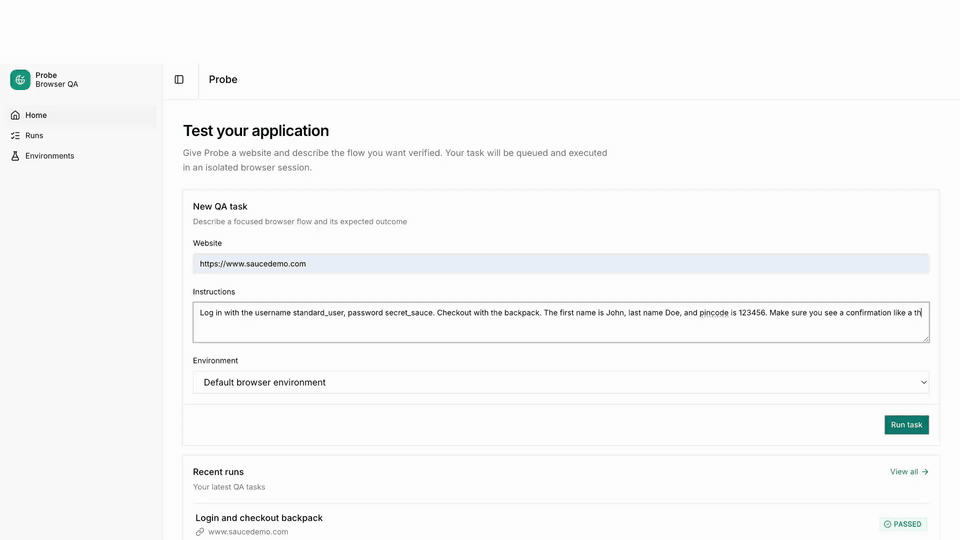

# Probe

Probe is a full-stack AI browser QA platform. Submit a website and a plain-English
test goal; Probe plans a bounded workflow, operates Chromium, verifies the result,
and streams progress, evidence, cost, and a video replay to the UI.

It is built around a text-first agent: semantic DOM observations and structured
Pydantic AI outputs guide Playwright, while deterministic Python enforces actions,
assertions, origin restrictions, and execution limits. This keeps vision usage and
LLM cost low without allowing model-generated code to control the browser.



## What it includes

- Next.js interface for submitting, monitoring, cancelling, and rerunning QA tasks
- FastAPI API with Server-Sent Events for live run and queue updates
- Temporal workflows with a separate, concurrency-limited browser worker
- PostgreSQL run history and S3-compatible replay storage through local MinIO
- Named test environments for headers, cookies, viewport, and secret references
- Versioned prompts, failure categories, Langfuse traces, token usage, and cost
- Repeated-trial evaluation suites with JSON reports and baseline comparisons
- Docker Compose and local kind/Kubernetes deployments

## Quick start

Requirements: Docker and a DeepSeek API key.

```bash
cp .env.example .env
# Add DEEPSEEK_API_KEY to .env
docker compose up --build
```

Open the app at http://localhost:3000. The API documentation is available at
http://localhost:8000/docs, MinIO at http://localhost:9001, and Temporal at
http://localhost:8233.

Stop the stack with `docker compose down`. Add `-v` only when you also want to
delete its PostgreSQL, MinIO, and Temporal data.

## CLI and evaluations

Install the local development environment:

```bash
uv sync
uv run playwright install chromium
```

Run one task directly:

```bash
uv run probe run https://www.saucedemo.com/ \
  "Log in and verify that the inventory page loads"
```

Run the reproducible SauceDemo benchmark and optionally compare it with a baseline:

```bash
uv run probe eval evals/suites/saucedemo-smoke.json --trials 3
uv run probe eval evals/suites/saucedemo-smoke.json --trials 3 \
  --baseline .eval-reports/baseline.json
```

## Local Kubernetes

With Docker, kind, kubectl, and ripgrep installed:

```bash
./scripts/kind-up.sh
kubectl -n probe port-forward service/probe-client 3000:3000
kubectl -n probe port-forward service/probe-api 8000:8000
```

The script builds and loads local images, provisions PostgreSQL, MinIO, and
Temporal, runs setup Jobs, and deploys the API, client, and one browser worker.
Inspect it with `kubectl -n probe get pods`; delete the cluster and its data with
`./scripts/kind-down.sh`.

## Development

```bash
uv run ruff check src tests
uv run ty check src tests
uv run pytest
cd client && bun run lint && bun run build
```

See [ROADMAP.md](ROADMAP.md) for deliberate limitations and remaining work.
